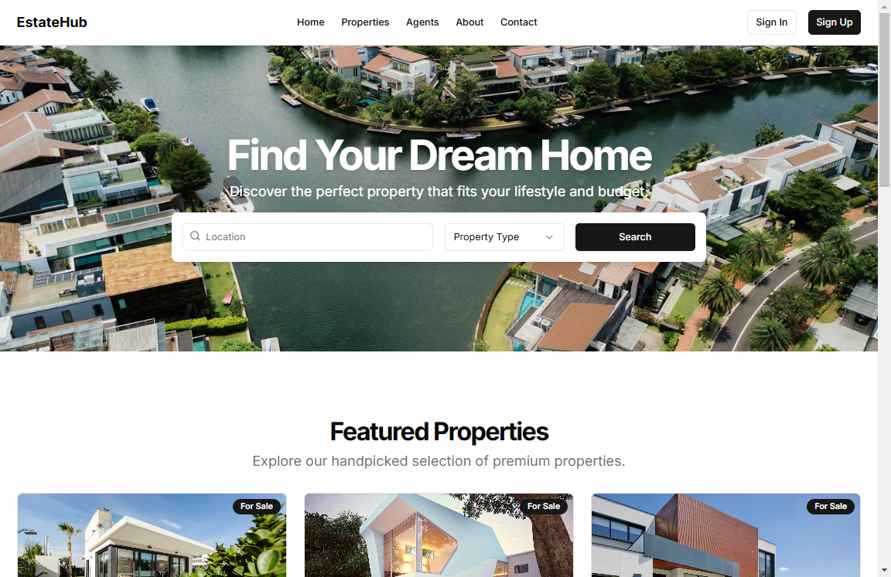

# EstateHub - Real Estate Website



A modern real estate website built with Next.js, featuring property listings, search functionality, and a beautiful UI.

## Features

- 🏠 Property search with filters
- 📱 Fully responsive design
- 🎨 Modern and clean UI
- 🔍 Advanced search functionality
- ✨ Featured properties section
- 👥 Testimonials section

## Tech Stack

- Next.js 14
- React 18
- TypeScript
- Tailwind CSS
- Shadcn UI Components

## Getting Started

1. Clone the repository:
```bash
git clone https://github.com/Up-to-code/real-estate.git
```

2. Install dependencies:
```bash
cd real-estate
npm install
```

3. Run the development server:
```bash
npm run dev
```

4. Open [http://localhost:3000](http://localhost:3000) in your browser

## Project Structure

```
├── app/
│   ├── components/
│   │   ├── client/
│   │   └── ui/
│   ├── page.tsx
│   └── layout.tsx
├── public/
└── package.json
```

## Key Components

- Modern homepage with hero section
- Property search with location and type filters
- Featured properties showcase
- Testimonials section
- Responsive navigation
- Footer with quick links

## Contributing

Contributions are welcome! Feel free to submit issues and pull requests.

## License

This project is licensed under the MIT License.

## Links

- [GitHub Repository](https://github.com/Up-to-code/real-estate)

## Author

**Up-to-code**
- GitHub: [@Up-to-code](https://github.com/Up-to-code)

---

Made with ❤️ by Up-to-code
 
